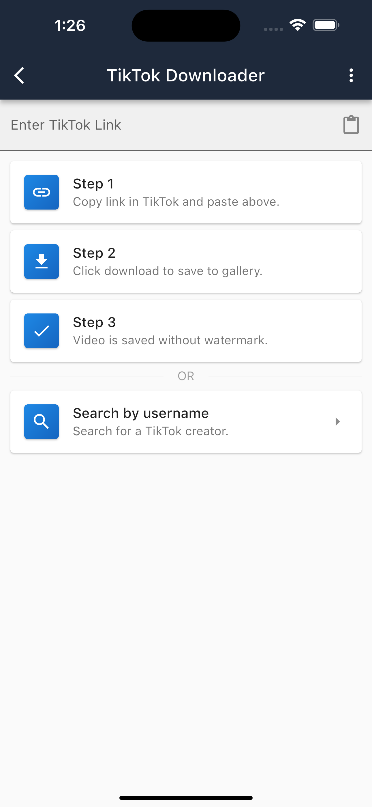

<h2 align="center">SaveItAll</h2>

Screenshot 1 | Screenshot 2 | Screenshot 3
:-:|:-:|:-:
 |  | 

## About

This repo hosts download links and issue discussion for the SaveItAll downloader app.

The SaveItAll app allows you to download the highest quality versions of content without watermarks from your favourite sites and apps.

At this stage, the supported apps/sites it can download from are:

- **TikTok**
  - Download profile images
  - Download video by link
  - Search users by username
  - Endless scroll of videos posted by user
  - Download all videos posted by a user

## Do you plan to support other apps/sites?

Yes! We want to add support for downloading from other apps/sites, some of the planned ones are:

- TikTok
  - Live Streams 
- Instagram
  - Profile images
  - Posts
  - Live Streams

## Found a bug or want a new feature?

- Search the issue tracker to make sure your bug or feature request has not already been submitted.
- If it's already submitted, feel free to comment on the existing issue.
- If there is no issue for your bug or feature request, open a new issue with as much information as you can.

## Why is this app not on Google Play?

Google Play has lots of policies in place that make it difficult to distribute "downloader" apps.
There are a lot of them already, but most of them are by anonymous developers.
For now, you can download the APK directly from this repo. I may upload to Google Play in the future.

## Is this app available on iOS?

The app has been developed in Flutter, so it can be built and run on iOS as well. However similar policies on the App Store are painful to deal with.
I may upload an unsigned IPA in the future that you can side load.

## How to download?

Visit the [releases](https://github.com/SaveItAll/saveitall-app/releases) page and download the latest APK for Android or IPA for iOS.
